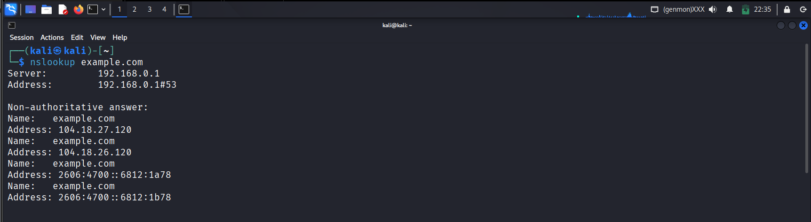
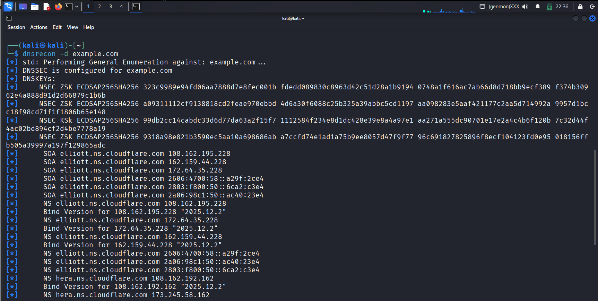
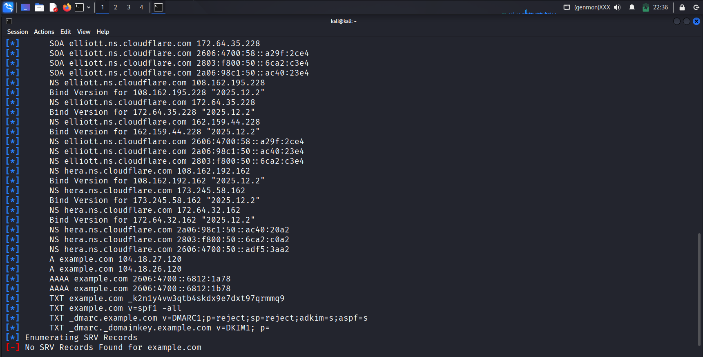

## 🎯 Objective
To perform DNS enumeration to discover DNS records and infrastructure details of a target domain.

## 🛠 Tools Used
- nslookup
- dig
- dnsrecon 

## 📌 Steps Performed
1. Selected a target domain (example.com)  
2. Queried DNS records using nslookup  
3. Retrieved detailed DNS info using dig  
4. Enumerated possible DNS data using dnsrecon  

## ✅ Result
Successfully identified DNS servers and records associated with the target domain.

## ⚠️ Security Impact
Exposed DNS records reveal network structure which attackers can use for further attacks.

## 🛡 Prevention & Mitigation
- Restrict zone transfers  
- Harden DNS servers  
- Monitor DNS exposure  

### 📸 Evidence

  

  

