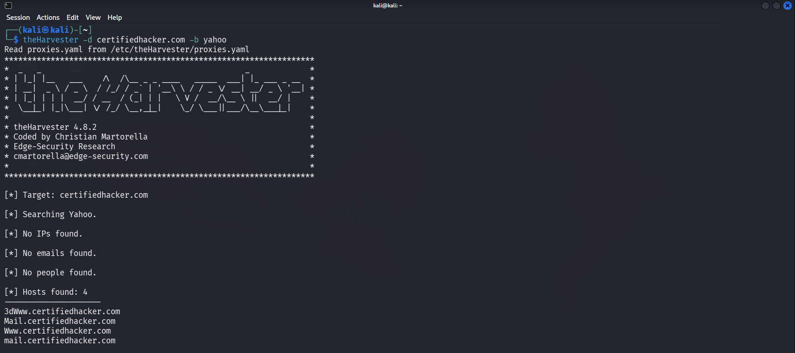
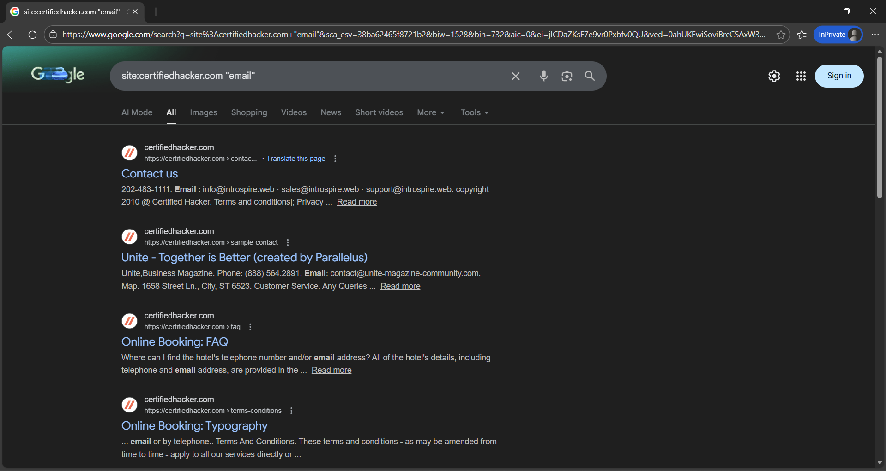

## 🎯 Objective
To collect publicly available email addresses related to a target domain using OSINT techniques.

## 🛠 Tools Used
- Google Dorking
- theHarvester

## 📌 Steps Performed
1. Used search engine queries to locate public email addresses  
2. Identified employee contact information on public pages  
3. Automated email collection using theHarvester  

## ✅ Result
Successfully gathered publicly exposed email addresses associated with the target domain.

## ⚠️ Security Impact
Exposed emails can be exploited for phishing, spam, and social engineering attacks.

## 🛡 Prevention & Mitigation
- Avoid publishing emails in plain text  
- Use contact forms instead of direct emails  
- Monitor public data exposure  

### 📸 Evidence

  

