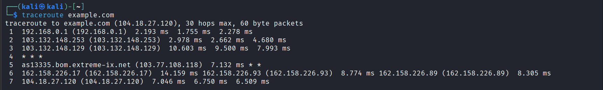
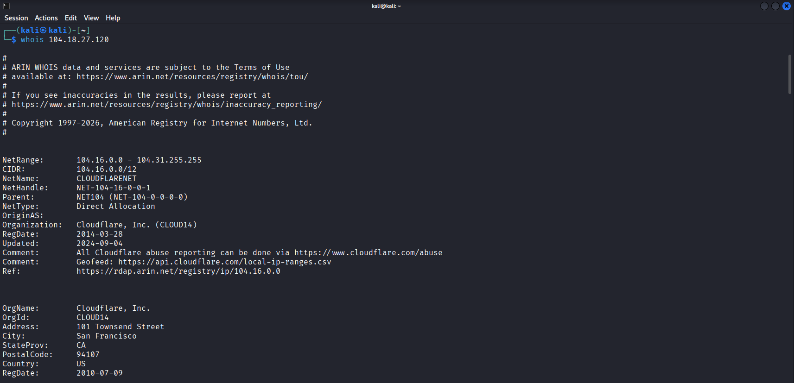
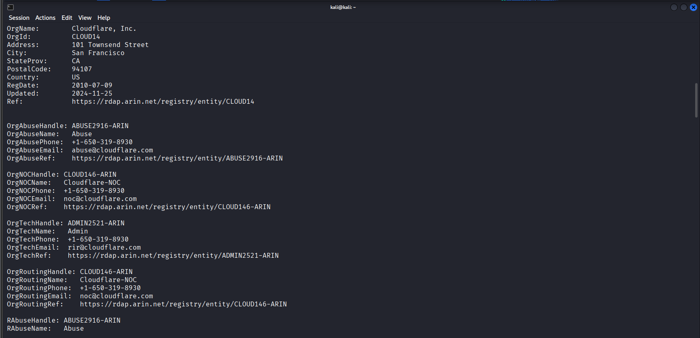
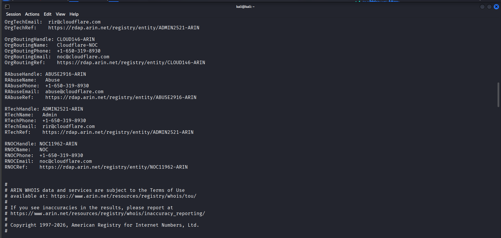

## 🎯 Objective
To perform IP and network footprinting to identify network path, ISP information, and geographical location of a target.

## 🛠 Tools Used
- ping
- traceroute
- whois
- geoiplookup

## 📌 Steps Performed
1. Identified target IP address using ping  
2. Traced network route using traceroute  
3. Retrieved ISP and network details using whois  
4. Determined geographical location using GeoIP  

## ✅ Result
Successfully identified network path, service provider, and approximate location of the target system.

## ⚠️ Security Impact
Network and location information helps attackers map infrastructure and plan targeted attacks.

## 🛡 Prevention & Mitigation
- Limit ICMP responses  
- Hide network infrastructure where possible  
- Use firewalls and monitoring  

### 📸 Evidence

  
  
  
 
 

