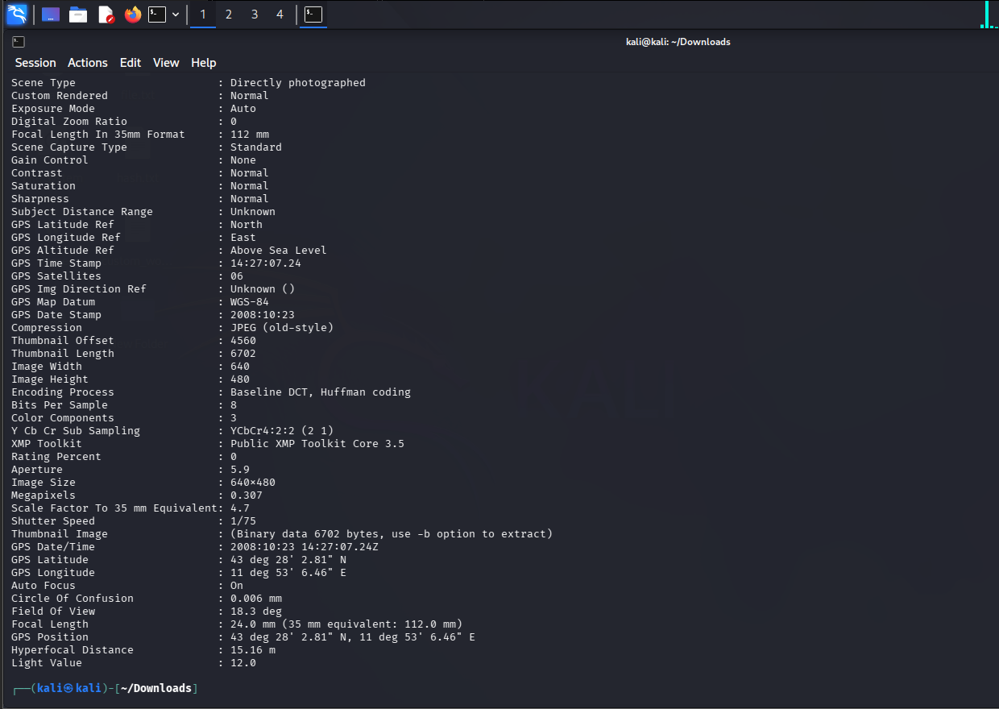

## 🎯 Objective
To extract hidden metadata from public files to identify author information, software used, and internal details.

## 🛠 Tools Used
- exiftool

## 📌 Steps Performed
1. Obtained a publicly available document  
2. Analyzed file metadata using exiftool  
3. Extracted author name and software details  
4. Reviewed internal file information  

## ✅ Result
Successfully retrieved hidden metadata revealing file author, creation tool, and other internal information.

## ⚠️ Security Impact
Metadata may expose sensitive organizational information useful for reconnaissance and social engineering.

## 🛡 Prevention & Mitigation
- Remove metadata before publishing files  
- Use metadata cleaning tools  
- Implement secure document publishing practices  

### 📸 Evidence

  

