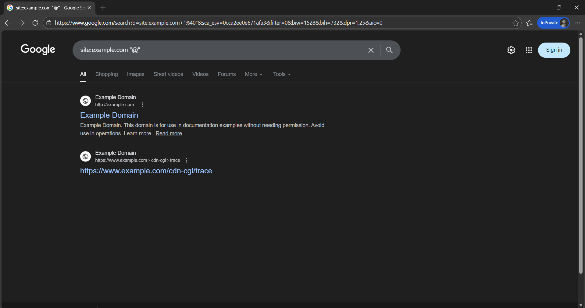
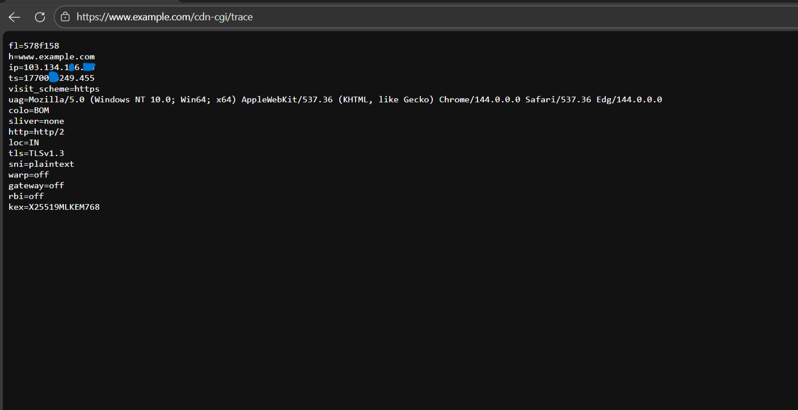
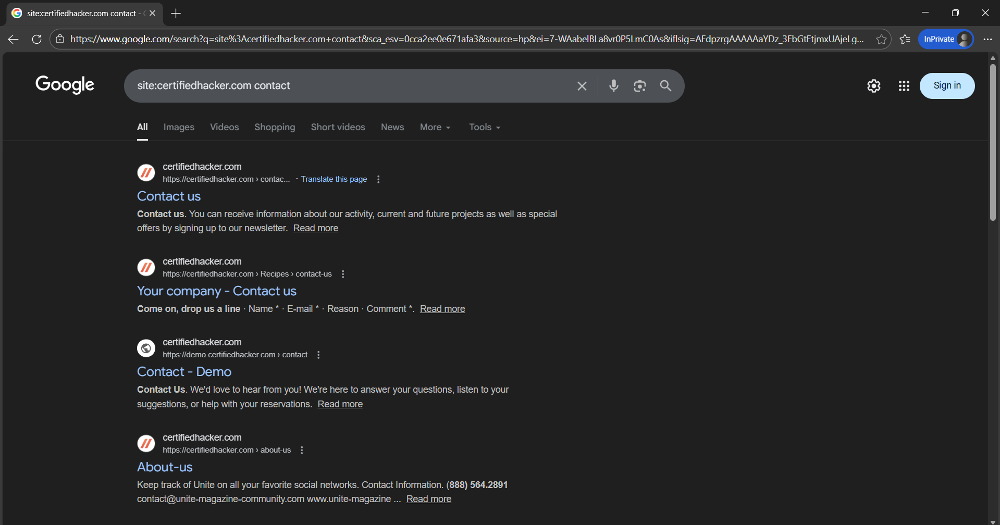
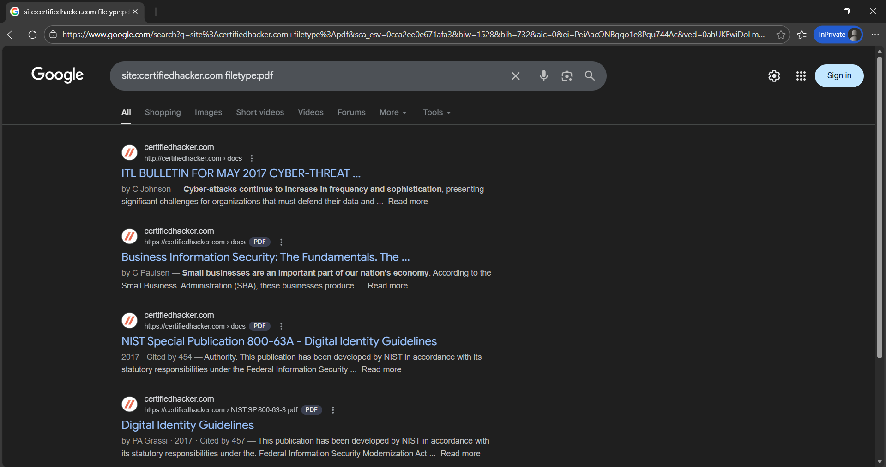
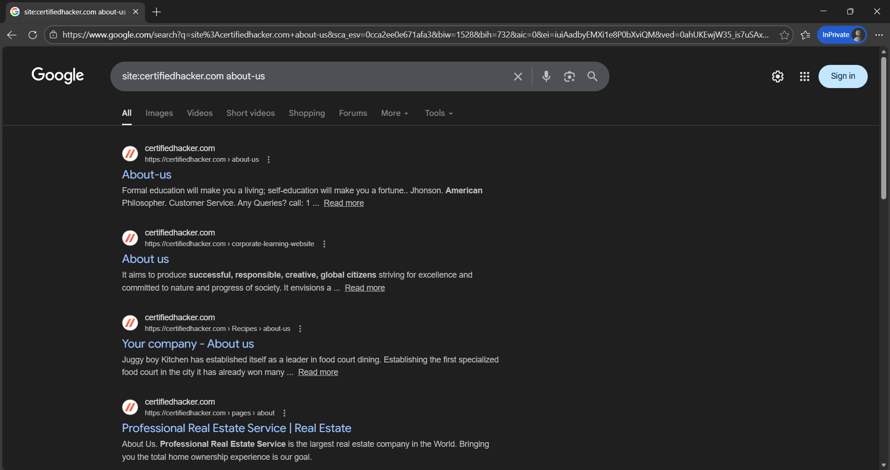
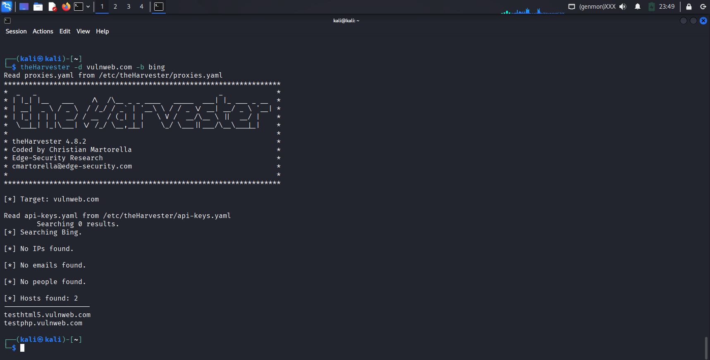

## 🎯 Objective
To gather publicly available information about a target organization using OSINT techniques.

## 🛠 Tools Used
- Google Dorking
- theHarvester (optional)

## 📌 Steps Performed
1. Searched for public emails and contact info  
2. Discovered exposed documents using search queries  
3. Collected publicly available organization details  
4. Automated data collection using theHarvester  

## ✅ Result
Identified publicly exposed emails, documents, and organizational information.

## ⚠️ Security Impact
Publicly available data can be leveraged for phishing, social engineering, and targeted attacks.

## 🛡 Prevention & Mitigation
- Limit sensitive public data  
- Monitor exposed documents  
- Educate employees on data sharing  

### 📸 Evidence

 
 
 
  
 

