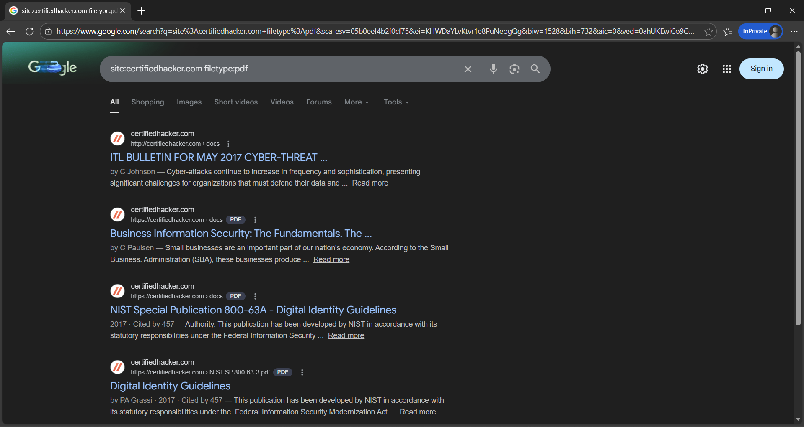
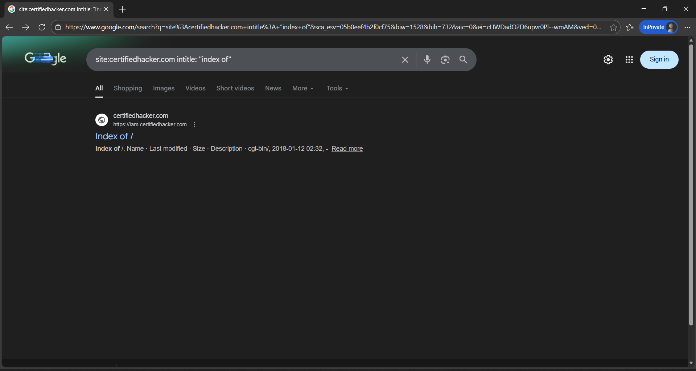
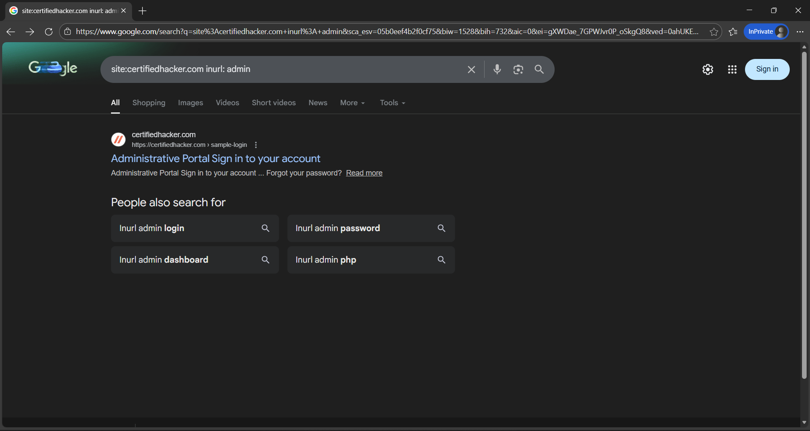

## 🎯 Objective
To identify publicly exposed files and directories using search engine footprinting techniques.

## 🛠 Tools Used
- Google search engine

## 📌 Steps Performed
1. Used site operator to list indexed pages  
2. Discovered exposed documents using filetype search  
3. Identified directory listings using intitle queries  
4. Located admin-related URLs  

## ✅ Result
Identified publicly accessible files and directories indexed by search engines.

## ⚠️ Security Impact
Search engines can expose sensitive resources useful for attackers.

## 🛡 Prevention & Mitigation
- Restrict directory indexing  
- Use robots.txt carefully  
- Secure sensitive files  

### 📸 Evidence

  

  

