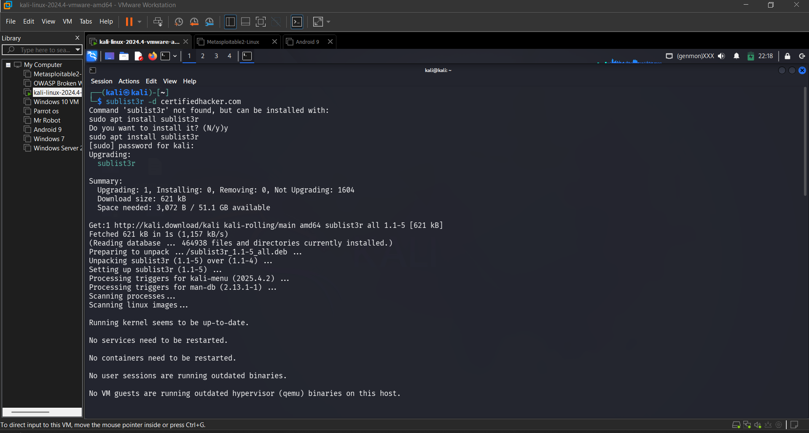
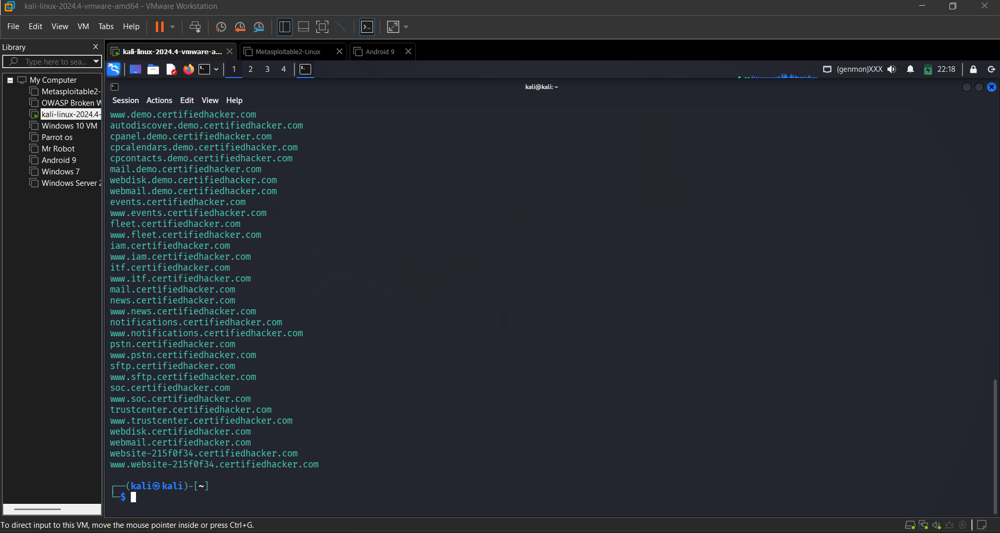
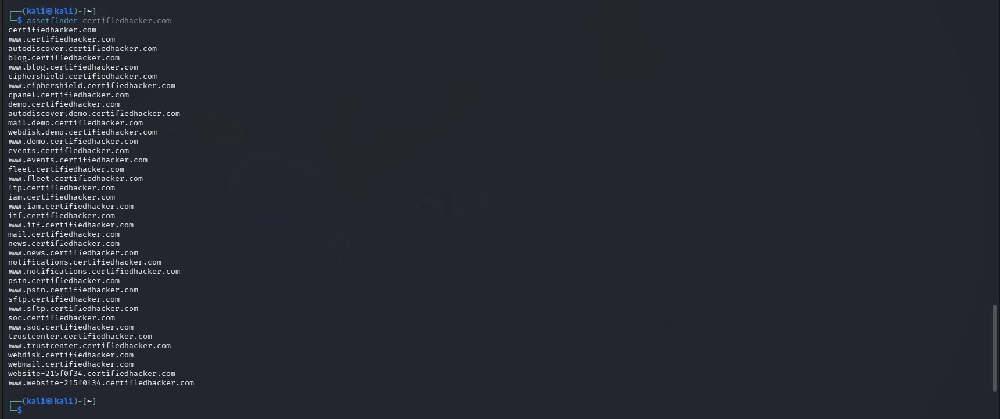
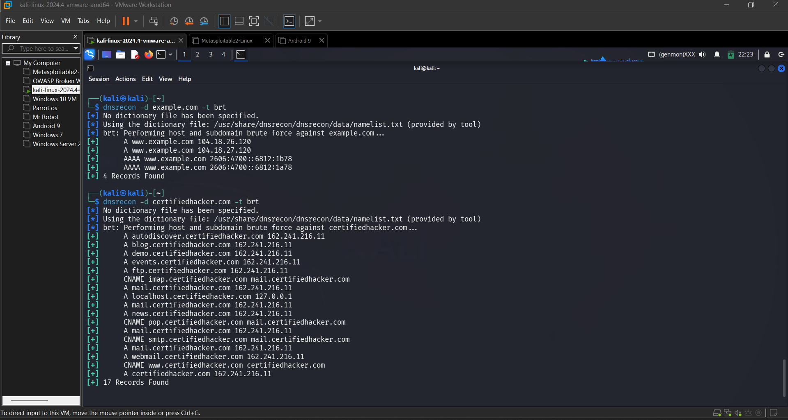

## 🎯 Objective
To identify subdomains associated with a target domain to expand the attack surface.

## 🛠 Tools Used
- Sublist3r
- assetfinder
- dnsrecon

## 📌 Steps Performed
1. Performed passive subdomain discovery using Sublist3r  
2. Enumerated additional subdomains using assetfinder  
3. Conducted DNS brute force using dnsrecon  

## ✅ Result
Successfully discovered multiple subdomains related to the target domain.

## ⚠️ Security Impact
Hidden subdomains may expose vulnerable development or internal services.

## 🛡 Prevention & Mitigation
- Monitor DNS records regularly  
- Remove unused subdomains  
- Apply security controls to all services  

### 📸 Evidence

  
  
  
  

