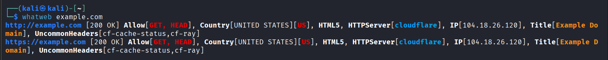
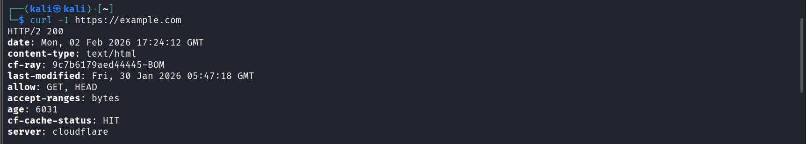

## 🎯 Objective
To identify technologies used by a target website including server type, CMS, and frameworks.

## 🛠 Tools Used
- whatweb
- curl (HTTP headers)

## 📌 Steps Performed
1. Selected a target website (example.com)  
2. Identified technologies using WhatWeb  
3. Retrieved server headers using curl  
4. Analyzed web stack information  

## ✅ Result
Discovered server type, website technologies, and platform details of the target website.

## ⚠️ Security Impact
Revealed technology stack helps attackers exploit known vulnerabilities in specific platforms.

## 🛡 Prevention & Mitigation
- Hide server headers  
- Keep software updated  
- Use web application firewall  

### 📸 Evidence

  

