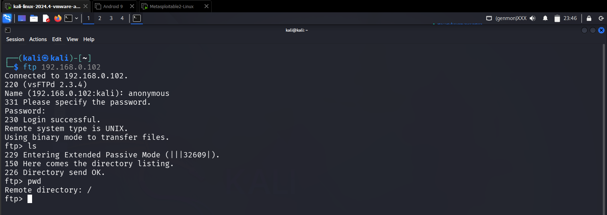
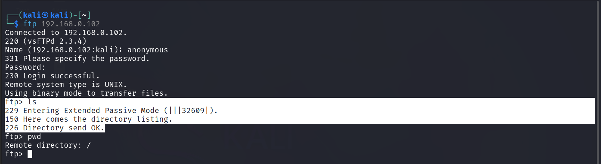

## 🎯 Objective
To enumerate FTP services in order to identify anonymous access and exposed files.

## 🛠 Tools Used
- ftp
- nmap

## 📌 Steps Performed
1. Verified FTP service availability on target system  
2. Attempted anonymous FTP login  
3. Listed accessible directories and files  
4. Tested file download capability  

## ✅ Result
Anonymous FTP access was allowed, and files were accessible on the target server.

## ⚠️ Security Impact
Misconfigured FTP services can expose sensitive files and allow unauthorized data access.

## 🛡 Prevention & Mitigation
- Disable anonymous FTP login  
- Enforce authentication  
- Restrict file permissions  
- Monitor FTP activity  

### 📸 Evidence

  
  
  
