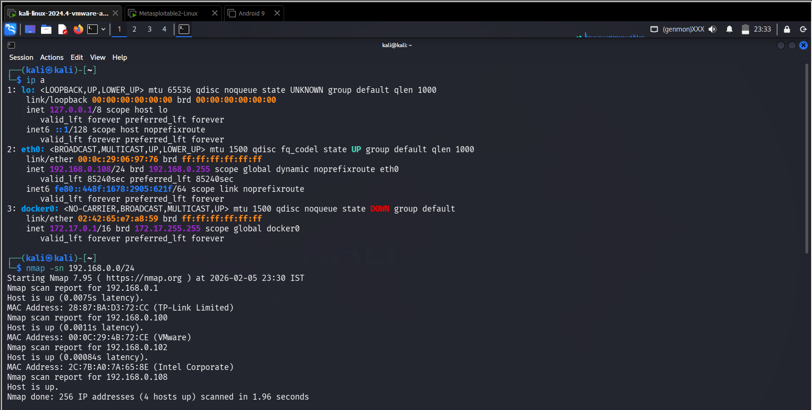

## 🎯 Objective
To identify live systems within a target network using host discovery techniques.

## 🛠 Tools Used
- nmap
- ping

## 📌 Steps Performed
1. Identified local network range  
2. Performed ping sweep using Nmap  
3. Verified live hosts using ping command  

## ✅ Result
Successfully discovered multiple active systems within the network.

## ⚠️ Security Impact
Host discovery allows attackers to identify potential targets for further attacks.

## 🛡 Prevention & Mitigation
- Block ICMP requests where possible  
- Use firewalls to restrict network scanning  
- Monitor network traffic  

### 📸 Evidence

  

