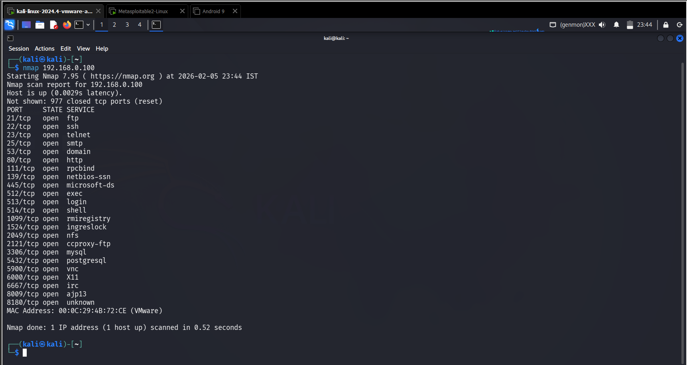
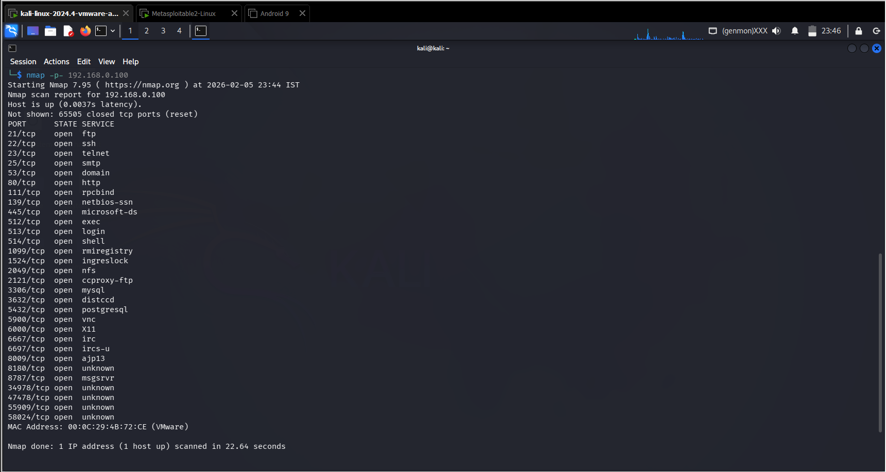
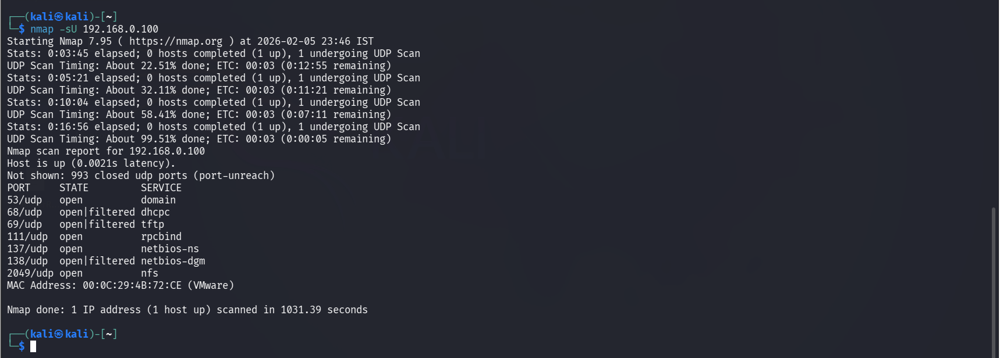

## 🎯 Objective
To identify open TCP and UDP ports on a target system to discover exposed services.

## 🛠 Tools Used
- nmap

## 📌 Steps Performed
1. Performed basic TCP port scan  
2. Conducted full port range scan  
3. Identified exposed services and open ports  

## ✅ Result
Successfully discovered multiple open ports including common service ports such as FTP, SSH, HTTP, and SMB.

## ⚠️ Security Impact
Open ports expose services that attackers can exploit to gain unauthorized access.

## 🛡 Prevention & Mitigation
- Close unused ports  
- Use firewalls to restrict access  
- Monitor network traffic  
- Patch exposed services  

### 📸 Evidence

  
  

