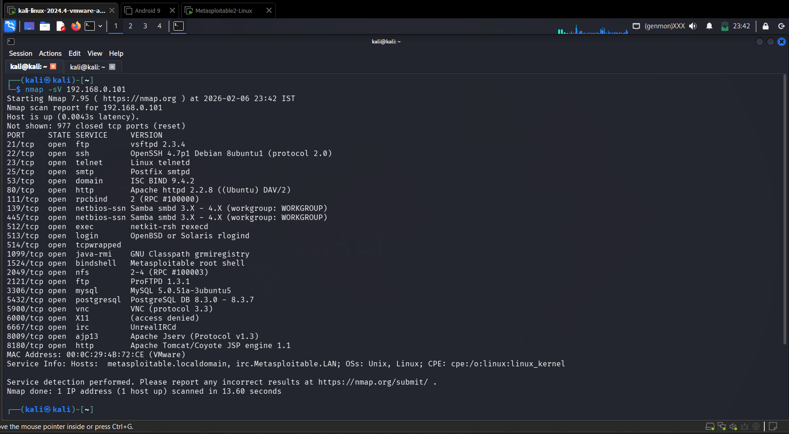
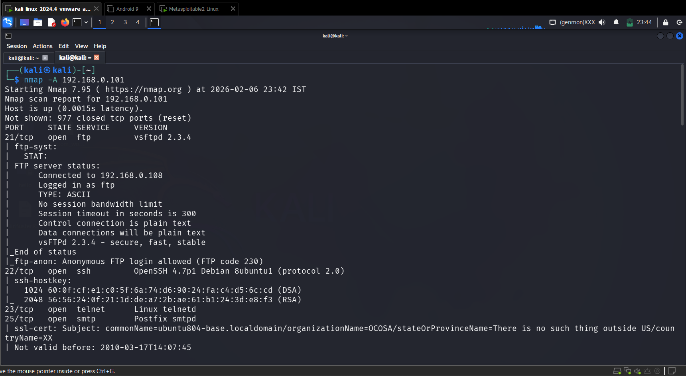
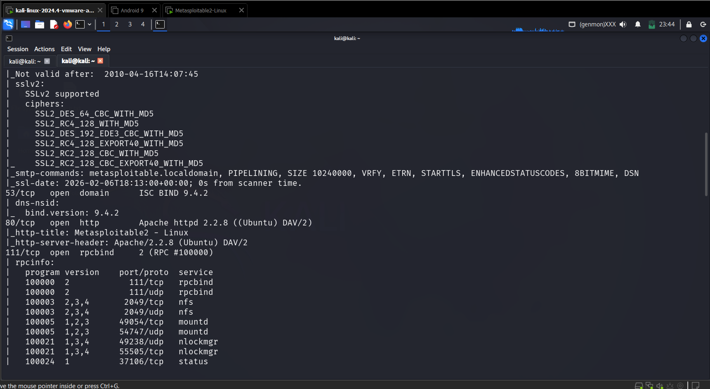
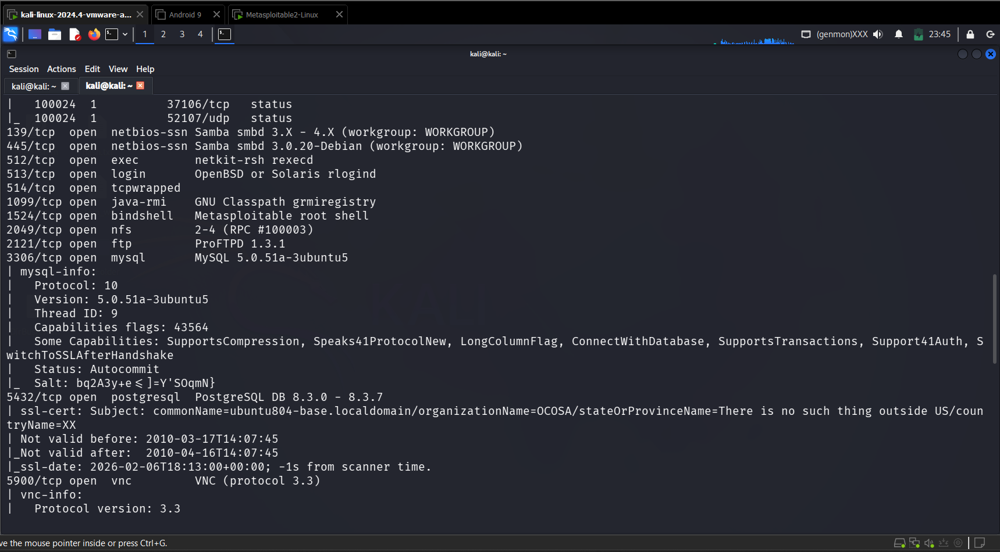
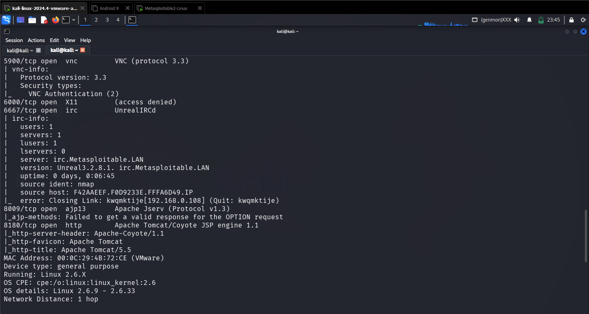

## 🎯 Objective
To identify running services and their versions on a target system for vulnerability mapping.

## 🛠 Tools Used
- nmap

## 📌 Steps Performed
1. Performed service version detection scan using Nmap  
2. Identified running services and their software versions  
3. Collected banner and system information  

## ✅ Result
Successfully detected multiple services including web server, SSH, FTP, and database along with their versions.

## ⚠️ Security Impact
Outdated or vulnerable service versions can be exploited to gain unauthorized access.

## 🛡 Prevention & Mitigation
- Keep services updated  
- Remove unnecessary services  
- Apply security patches  
- Monitor exposed software  

### 📸 Evidence

  

