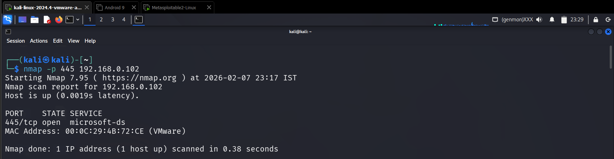
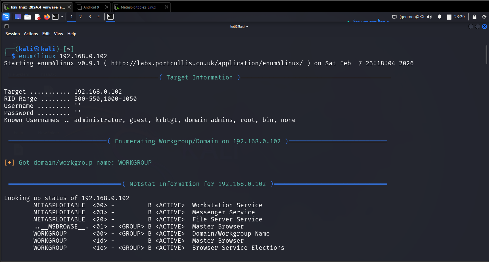
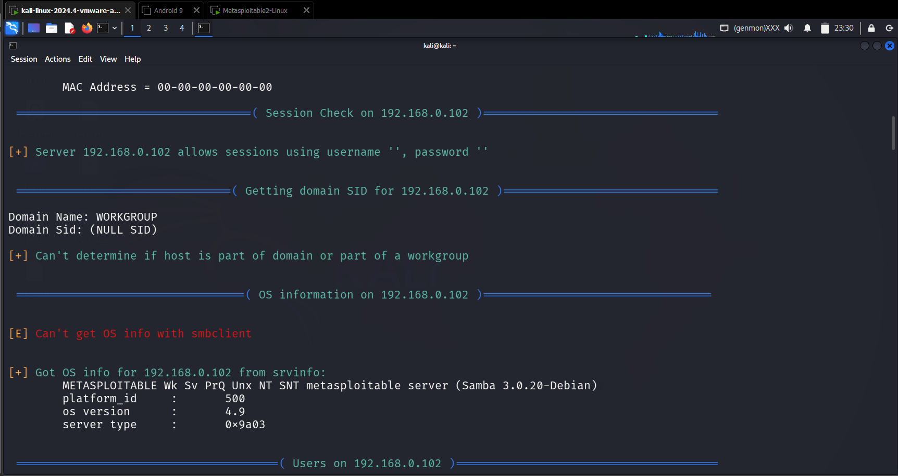
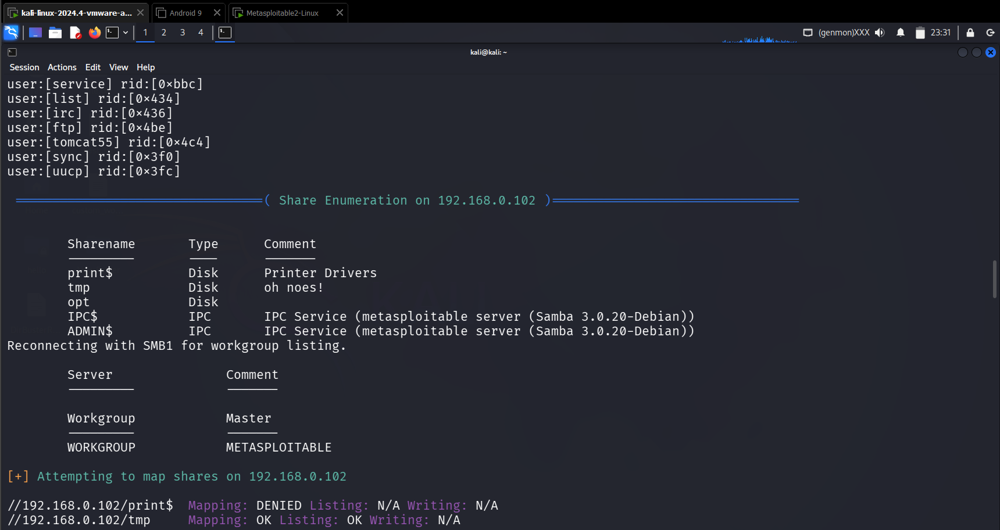
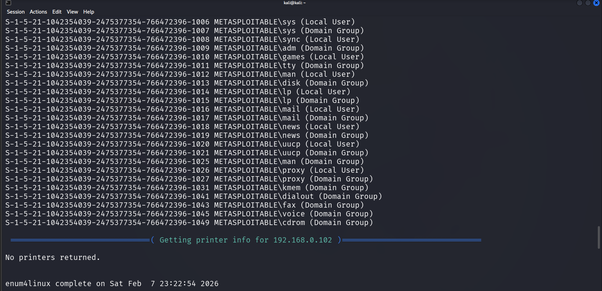
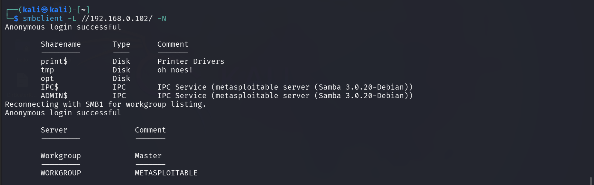
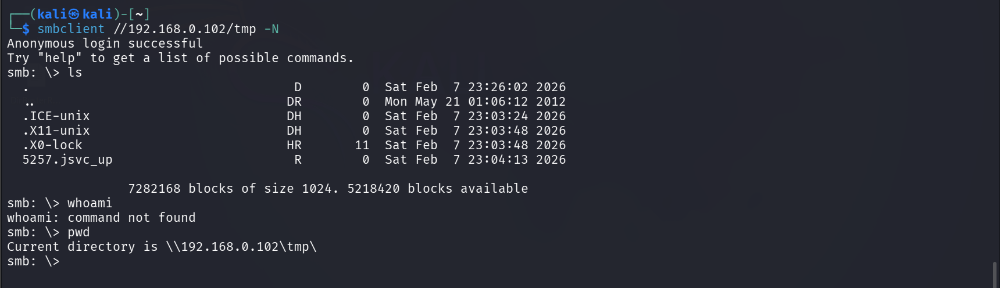

## 🎯 Objective
To enumerate SMB services in order to identify shared resources, users, and misconfigurations.

## 🛠 Tools Used
- enum4linux
- smbclient
- nmap

## 📌 Steps Performed
1. Verified SMB service availability on target system  
2. Enumerated users and shares using enum4linux  
3. Listed SMB shares using smbclient  
4. Attempted anonymous access to shared resources  

## ✅ Result
Successfully identified SMB shares and gathered system information from the target.

## ⚠️ Security Impact
Misconfigured SMB services can expose sensitive data and allow unauthorized access.

## 🛡 Prevention & Mitigation
- Disable anonymous SMB access  
- Restrict share permissions  
- Use strong authentication  
- Monitor SMB activity  

### 📸 Evidence

  
  
  
  
  
  

