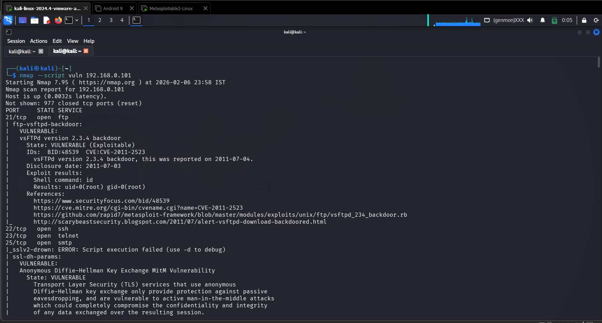
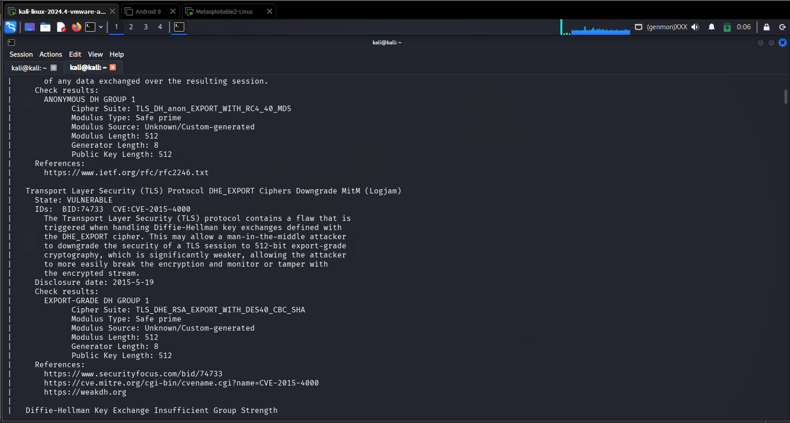
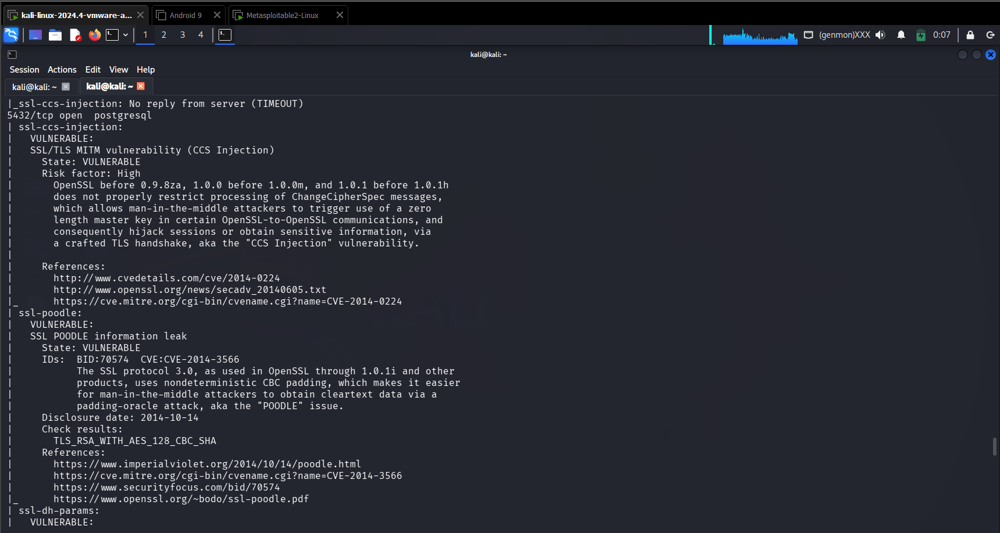
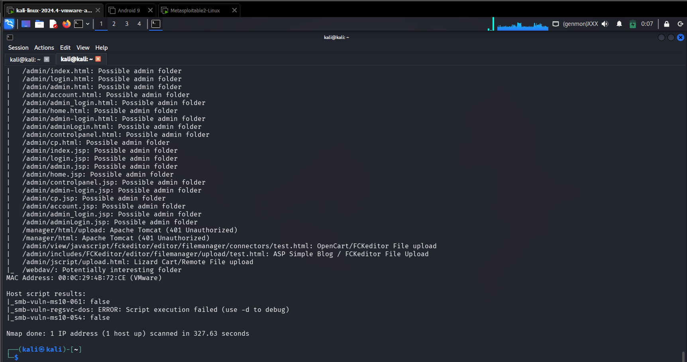
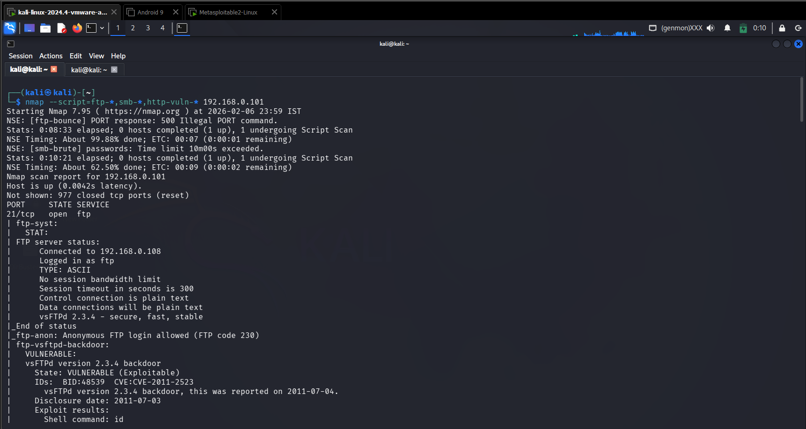
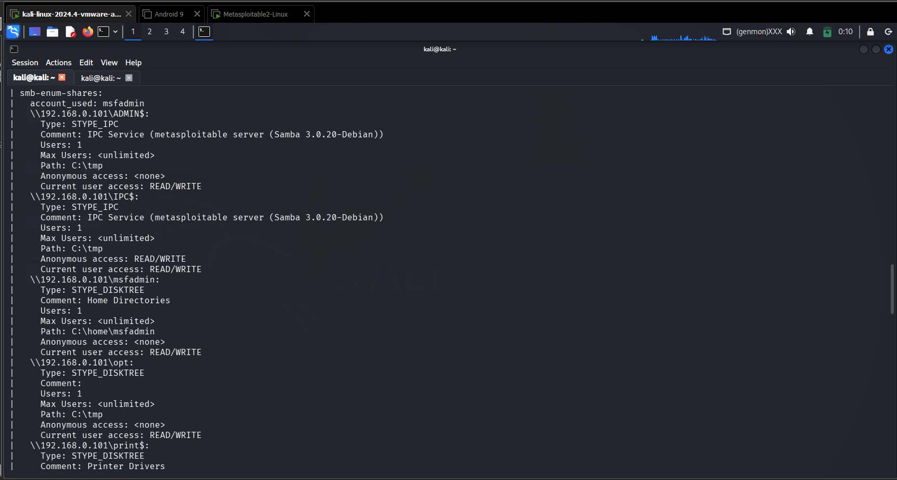

## 🎯 Objective
To identify known vulnerabilities and misconfigurations in target systems using automated scanning techniques.

## 🛠 Tools Used
- nmap (vulnerability scripts)

## 📌 Steps Performed
1. Executed vulnerability scanning using Nmap script engine  
2. Identified exposed services with known weaknesses  
3. Detected potential CVEs and misconfigurations  

## ✅ Result
Successfully discovered multiple vulnerabilities associated with running services on the target system.

## ⚠️ Security Impact
Unpatched vulnerabilities can allow attackers to gain unauthorized access and compromise systems.

## 🛡 Prevention & Mitigation
- Regular vulnerability patching  
- System updates  
- Security hardening  
- Continuous monitoring  

### 📸 Evidence

  

  

  

