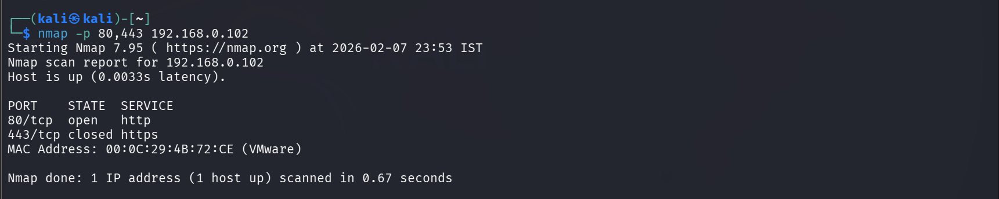
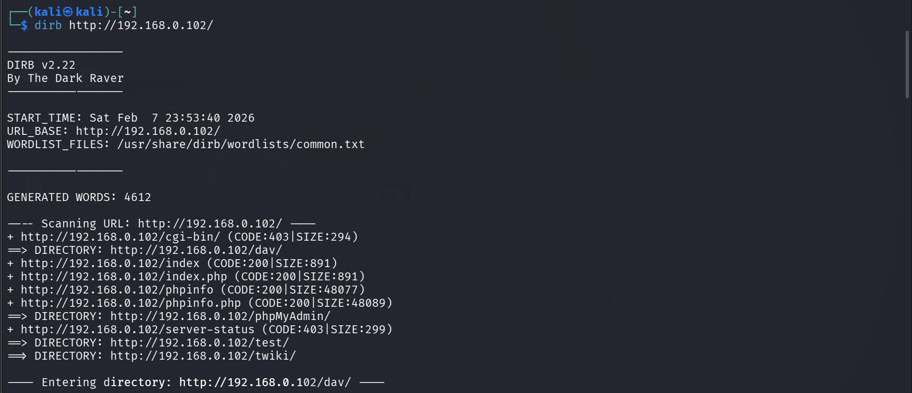
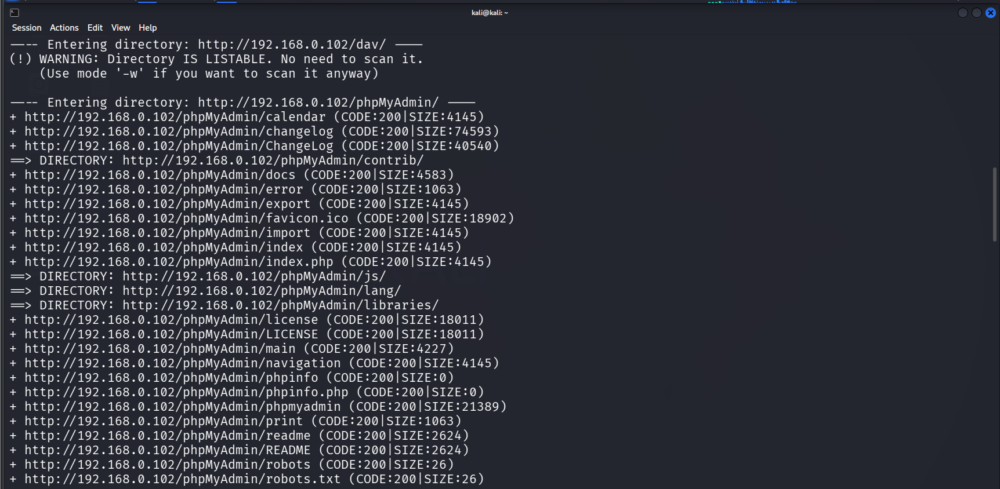
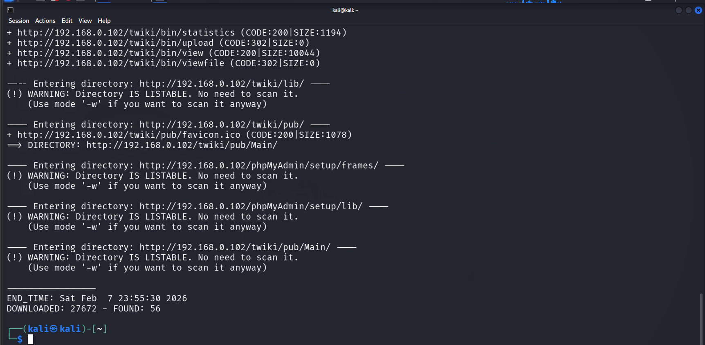
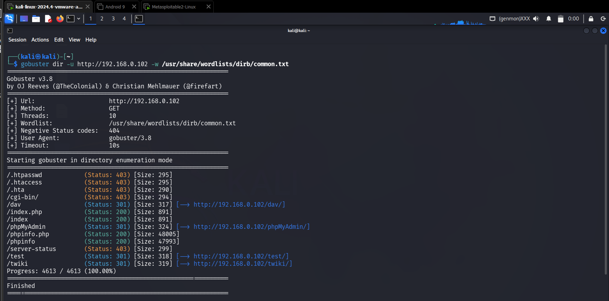

## 🎯 Objective
To enumerate web server directories and hidden resources to identify exposed attack surfaces.

## 🛠 Tools Used
- dirb
- gobuster
- nmap

## 📌 Steps Performed
1. Verified web server availability  
2. Performed directory brute forcing using Dirb  
3. Enumerated hidden paths using Gobuster  

## ✅ Result
Discovered hidden directories and web resources that were not directly visible from the main website.

## ⚠️ Security Impact
Exposed directories and admin panels can be exploited to gain unauthorized access or sensitive information.

## 🛡 Prevention & Mitigation
- Disable directory listing  
- Restrict access to admin pages  
- Remove unused files and directories  
- Use web application firewalls  

### 📸 Evidence

  
 
 
 

