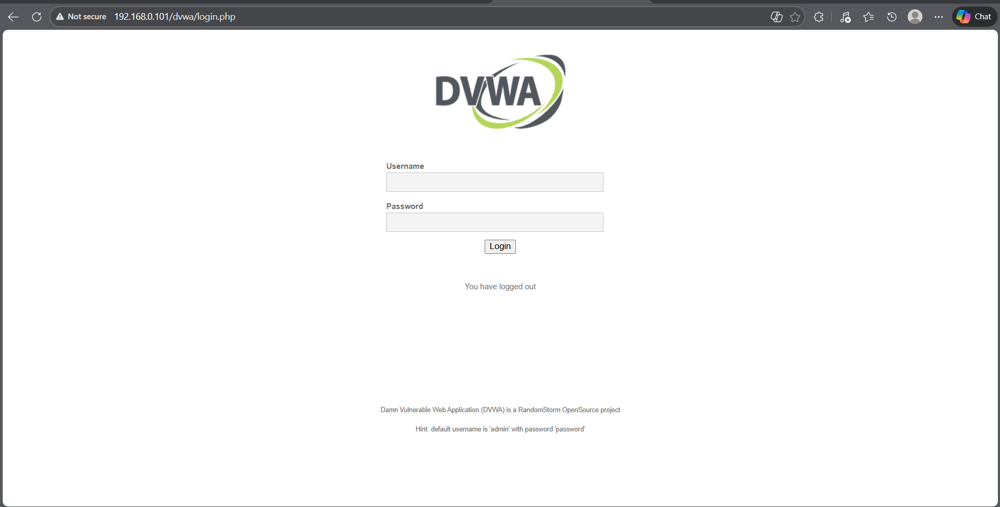
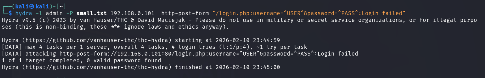
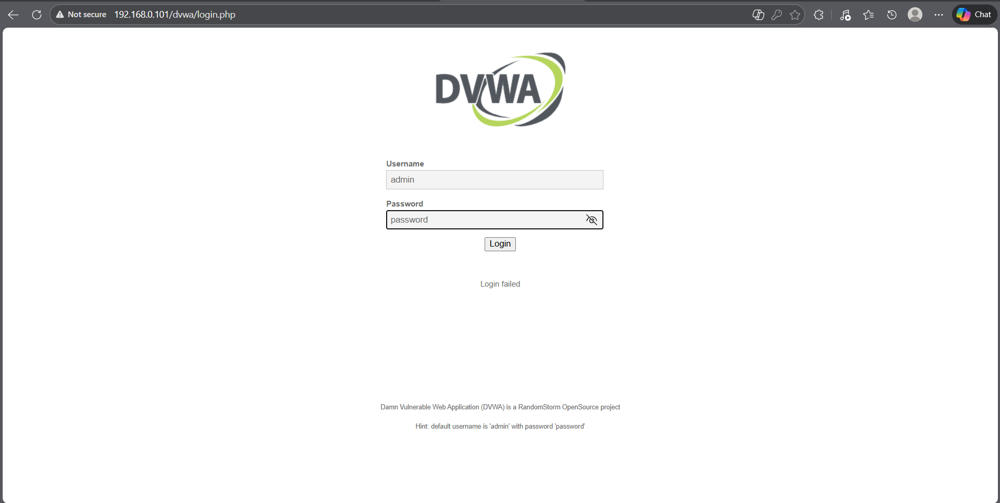

## 🎯 Objective
To evaluate the strength of authentication controls by assessing the presence of weak credentials in a controlled lab environment.

## 🛠 Tools Used
- Hydra
- Web browser
- DVWA (Damn Vulnerable Web Application)

## 📌 Steps Performed
1. Identified the DVWA login endpoint for authentication testing  
2. Prepared a minimal credential list containing common passwords  
3. Performed a controlled automated credential testing attempt using Hydra  
4. Observed limitations in automated testing due to CSRF token and session-based authentication mechanisms  
5. Verified authentication behavior manually through the web interface  

## ✅ Result
Automated credential testing using Hydra was unsuccessful due to CSRF token validation and session handling. Manual verification confirmed the presence of weak credentials, allowing unauthorized access to the application.

## ⚠️ Security Impact
Weak credentials can allow attackers to bypass authentication controls and gain unauthorized access. Even when automated attacks are restricted, manual exploitation remains possible if strong password policies are not enforced.

## 🛡 Prevention & Mitigation
- Enforce strong password policies  
- Implement account lockout and rate limiting  
- Use CSRF protection correctly  
- Enable multi-factor authentication  
- Monitor and log authentication attempts  

### 📸 Evidence
  
  
  

> Note: All testing was conducted in a controlled lab environment for educational purposes only.
