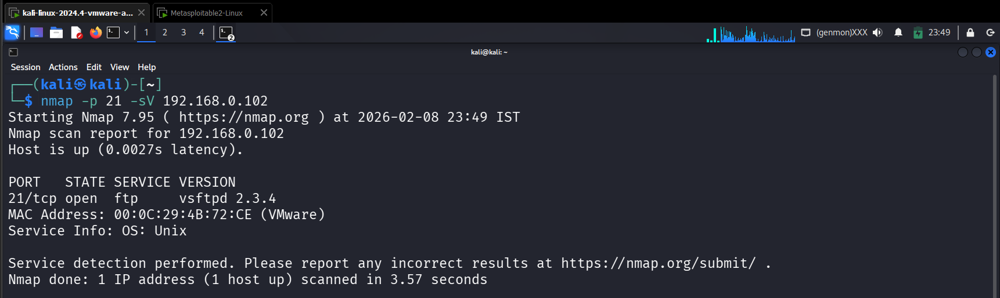
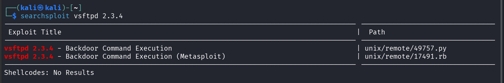
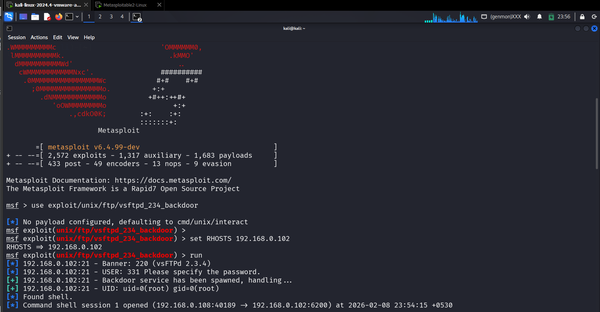
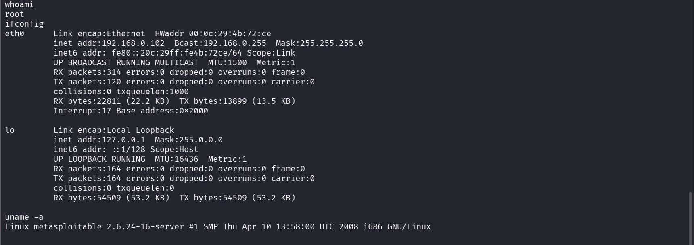

## 🎯 Objective
To exploit a vulnerable FTP service in order to gain unauthorized access to the target system.

## 🛠 Tools Used
- Metasploit Framework
- searchsploit
- nmap

## 📌 Steps Performed
1. Identified vulnerable FTP service and version  
2. Searched for known exploits using searchsploit  
3. Used Metasploit to exploit the FTP backdoor vulnerability  
4. Gained shell access to the target system  

## ✅ Result
Successfully exploited the vulnerable FTP service and obtained unauthorized shell access to the target.

## ⚠️ Security Impact
Exploiting vulnerable services allows attackers to gain remote access and fully compromise systems.

## 🛡 Prevention & Mitigation
- Patch vulnerable FTP services  
- Use secure and updated software versions  
- Restrict service exposure  
- Monitor for suspicious activity  

### 📸 Evidence

  
  
 
 

