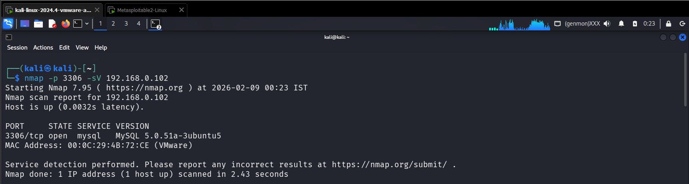
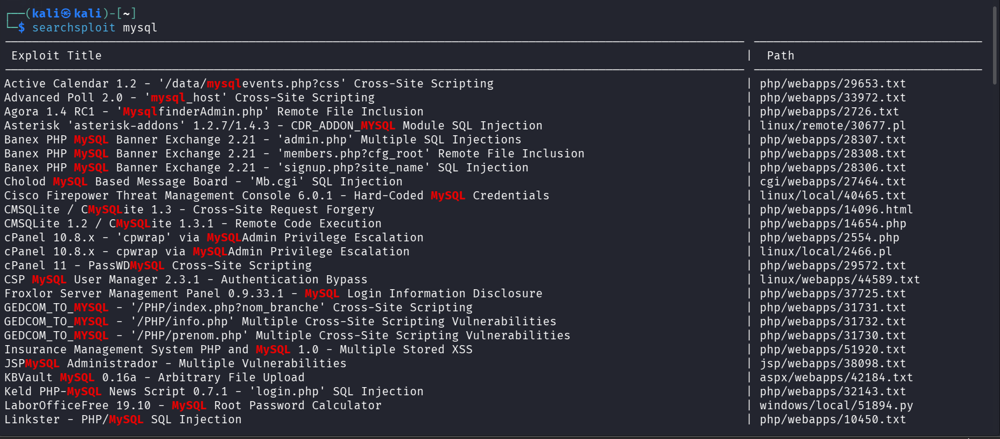

## 🎯 Objective
To exploit a misconfigured MySQL service in order to gain unauthorized database access.

## 🛠 Tools Used
- nmap
- MySQL client
- searchsploit

## 📌 Steps Performed
1. Identified MySQL service and version running on the target  
2. Researched known MySQL vulnerabilities  
3. Attempted authentication using weak/default credentials  
4. Attempted remote MySQL authentication; connection failed due to SSL/TLS configuration mismatch 

## ✅ Result
Remote authentication attempts against the MySQL service were unsuccessful due to SSL/TLS configuration restrictions, preventing unauthorized access.

## ⚠️ Security Impact
Although authentication was not achieved, exposing database services increases the attack surface and may lead to exploitation if encryption or access controls are misconfigured.

## 🛡 Prevention & Mitigation
- Enforce strong authentication  
- Restrict remote MySQL access  
- Use firewall rules  
- Regularly audit database security  

### 📸 Evidence

  
  
  
