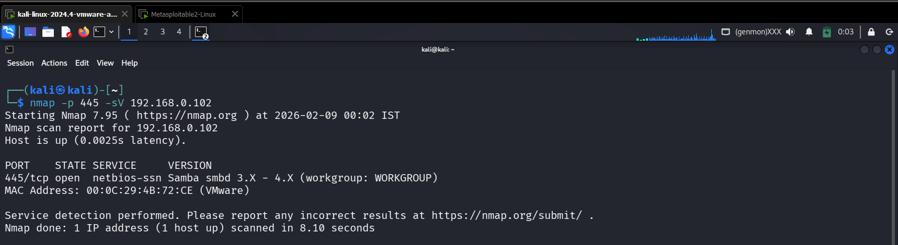
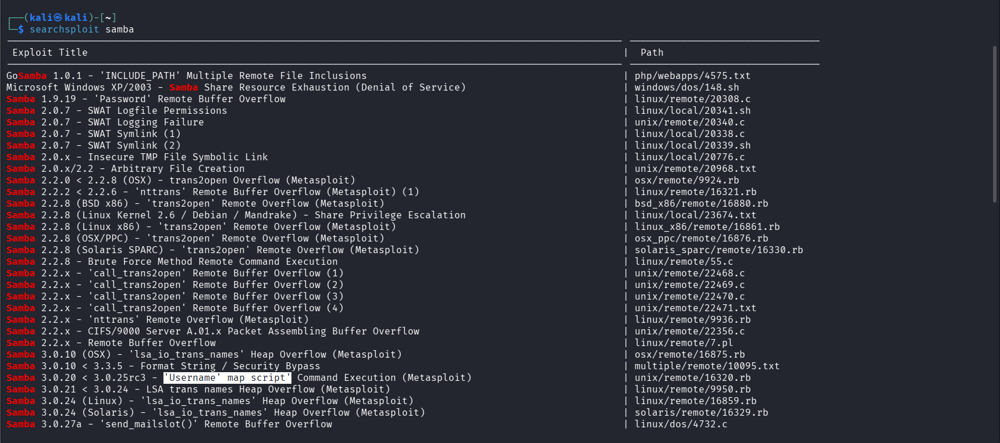
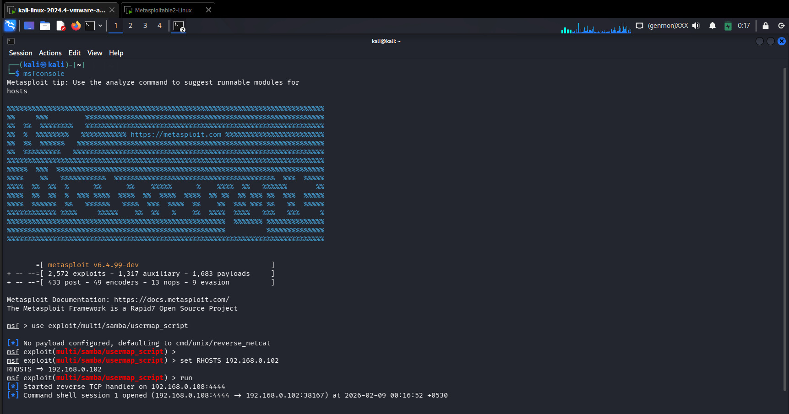
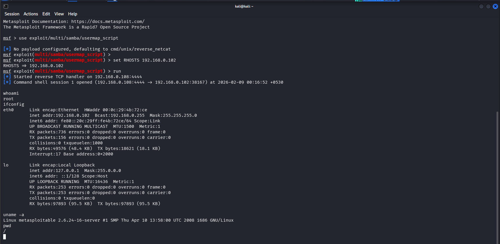

## 🎯 Objective
To exploit a vulnerable SMB service to gain unauthorized access to the target system.

## 🛠 Tools Used
- Metasploit Framework
- searchsploit
- nmap

## 📌 Steps Performed
1. Identified vulnerable SMB service and version  
2. Discovered known SMB exploits using searchsploit  
3. Exploited the SMB vulnerability using Metasploit  
4. Obtained shell access on the target system  

## ✅ Result
Successfully exploited the SMB service and gained unauthorized shell access.

## ⚠️ Security Impact
Vulnerable SMB services can allow attackers to execute remote commands and fully compromise systems.

## 🛡 Prevention & Mitigation
- Patch SMB services  
- Disable unnecessary SMB exposure  
- Restrict network access  
- Monitor SMB activity  

### 📸 Evidence

  
  
  

