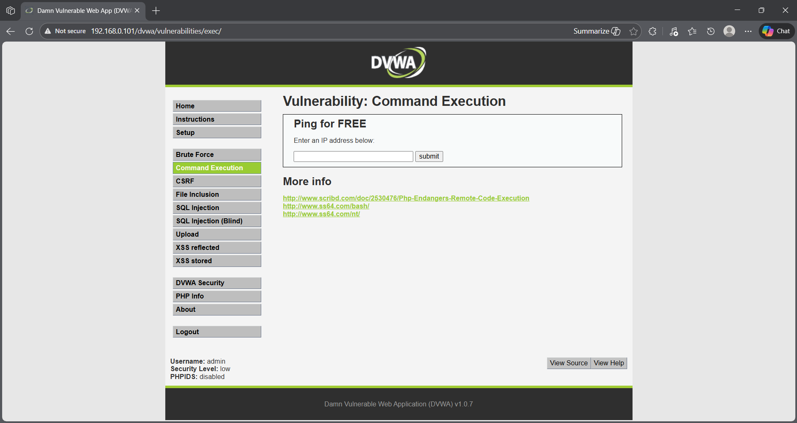
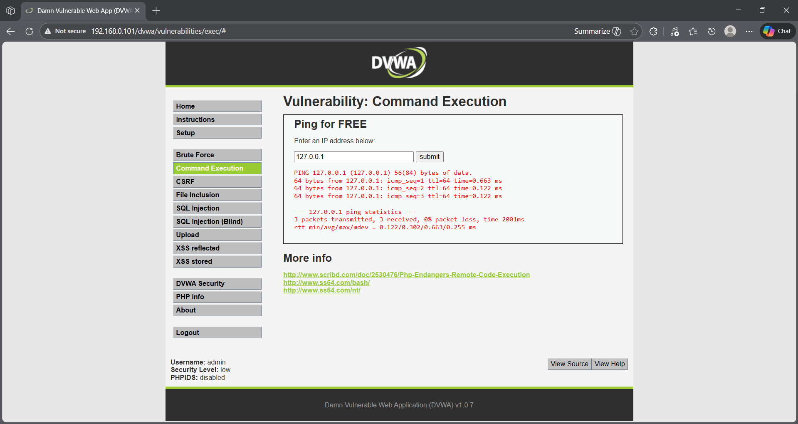
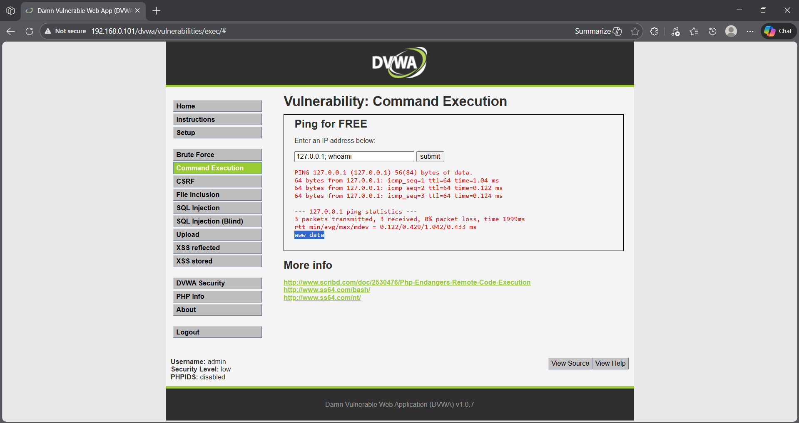
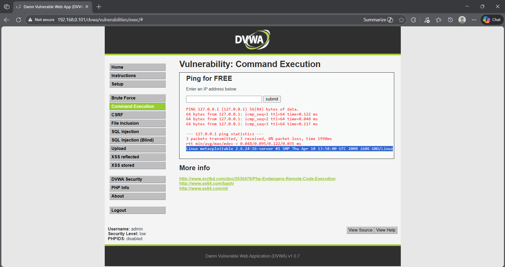

## 🎯 Objective
To exploit a command injection vulnerability in a web application to execute system-level commands.

## 🛠 Tools Used
- DVWA (Damn Vulnerable Web Application)
- Web browser

## 📌 Steps Performed
1. Set DVWA security level to low  
2. Accessed the command injection vulnerability page  
3. Tested normal command execution behavior  
4. Injected system commands through user input  
5. Verified command execution on the server  

## ✅ Result
Successfully executed arbitrary system commands on the server through command injection.

## ⚠️ Security Impact
Command injection vulnerabilities allow attackers to execute operating system commands, leading to full server compromise.

## 🛡 Prevention & Mitigation
- Validate and sanitize user input  
- Avoid passing user input to system commands  
- Use parameterized APIs  
- Apply least privilege principles  

### 📸 Evidence

  
 

  

