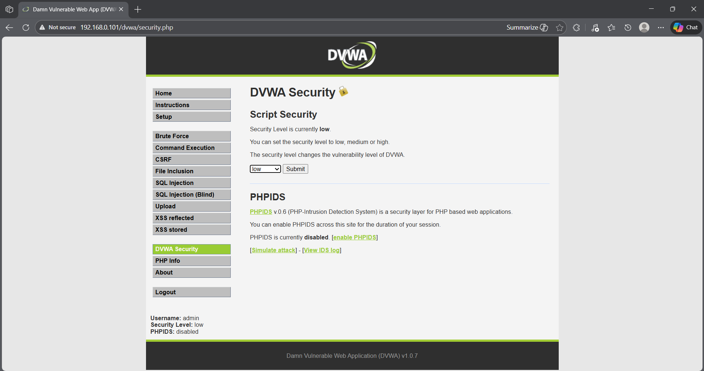
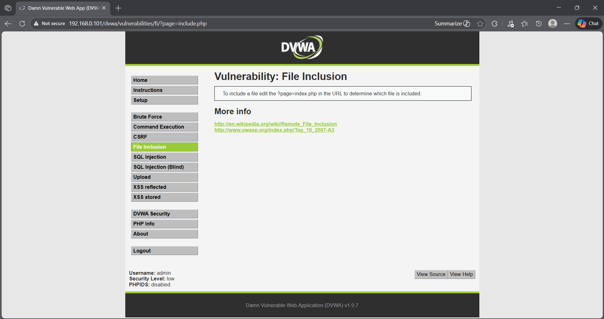
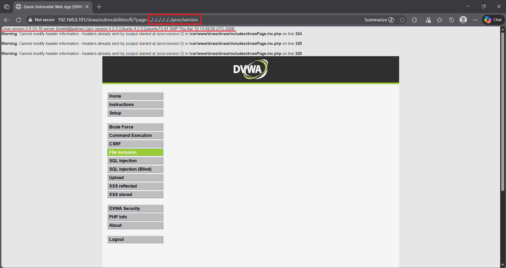
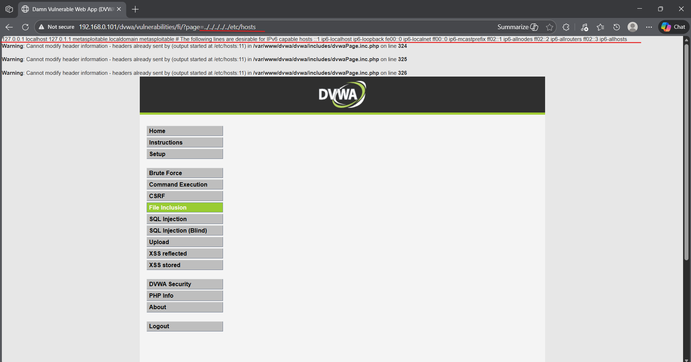

## 🎯 Objective
To exploit a file inclusion vulnerability in a web application to access sensitive server files.

## 🛠 Tools Used
- DVWA (Damn Vulnerable Web Application)
- Web browser

## 📌 Steps Performed
1. Set DVWA security level to low  
2. Accessed the file inclusion vulnerability page  
3. Observed normal file inclusion behavior  
4. Manipulated file parameters to include system files  
5. Retrieved sensitive server file contents  

## ✅ Result
Successfully accessed sensitive system files through local file inclusion.

## ⚠️ Security Impact
File inclusion vulnerabilities allow attackers to read sensitive files, leading to information disclosure and further compromise.

## 🛡 Prevention & Mitigation
- Validate and whitelist file paths  
- Avoid dynamic file inclusion  
- Implement proper access controls  
- Disable unnecessary file access  

### 📸 Evidence

  

1[working-page](lfi2.png)
  

