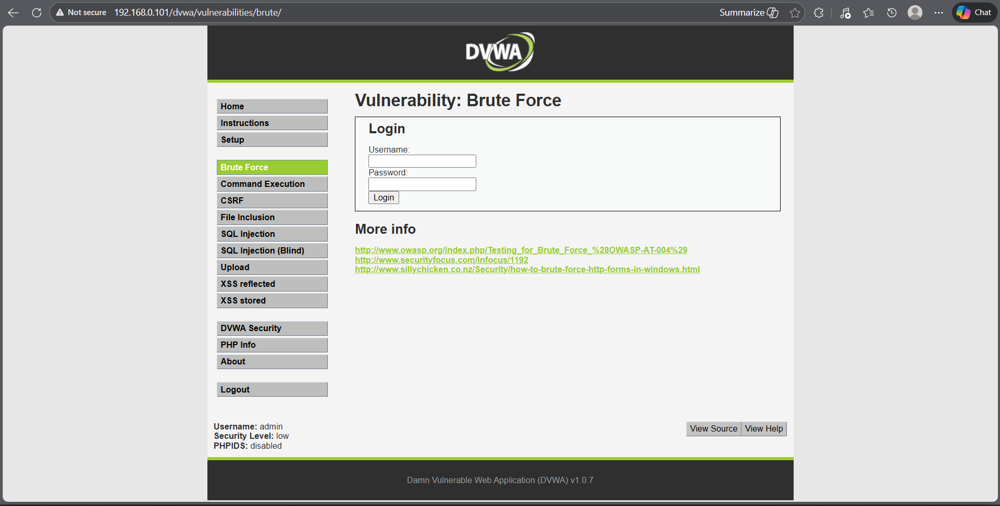
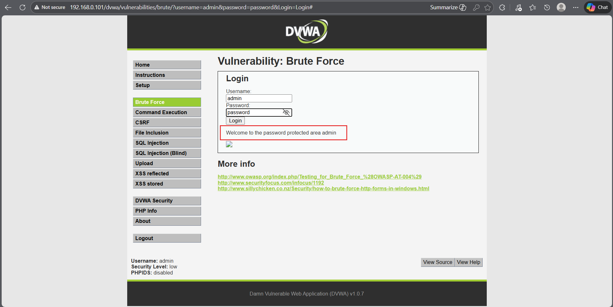

## 🎯 Objective
To exploit weak authentication mechanisms in a web application to gain unauthorized access.

## 🛠 Tools Used
- DVWA (Damn Vulnerable Web Application)
- Web browser

## 📌 Steps Performed
1. Set DVWA security level to low  
2. Accessed the weak authentication vulnerability page  
3. Attempted login using common and weak credentials  
4. Successfully bypassed authentication controls  

## ✅ Result
Unauthorized access was gained due to weak authentication mechanisms.

## ⚠️ Security Impact
Weak authentication allows attackers to bypass login controls, leading to account compromise and unauthorized access.

## 🛡 Prevention & Mitigation
- Enforce strong password policies  
- Implement account lockout mechanisms  
- Use multi-factor authentication  
- Monitor failed login attempts  

### 📸 Evidence

  
  

